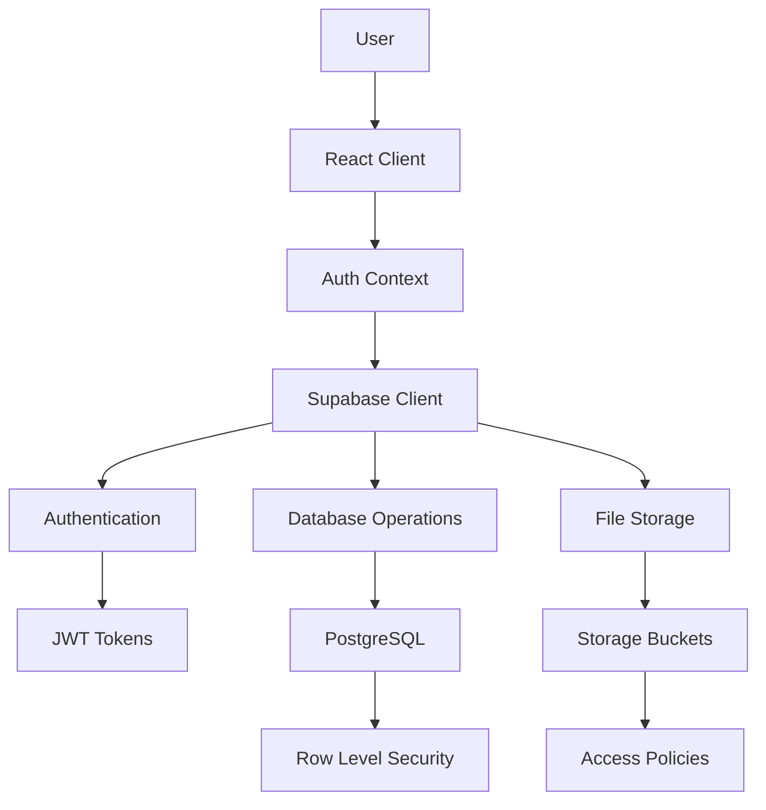

# Architecture Documentation

## Overview

HJC Chartered Accountants is a modern, scalable client portal built with a robust architecture prioritizing security, performance, and maintainability. This document outlines the system architecture, design decisions, and technical implementation details.

## Table of Contents

- [System Architecture](#system-architecture)
- [Technology Stack](#technology-stack)
- [Frontend Architecture](#frontend-architecture)
- [Backend Architecture](#backend-architecture)
- [Database Design](#database-design)
- [Security Architecture](#security-architecture)
- [Performance Considerations](#performance-considerations)
- [Deployment Architecture](#deployment-architecture)
- [Design Patterns](#design-patterns)
- [Scalability](#scalability)

## System Architecture

### High-Level Architecture

```
┌─────────────────┐    ┌─────────────────┐    ┌─────────────────┐
│   React Client  │◄──►│   Supabase      │◄──►│   PostgreSQL    │
│   (Frontend)    │    │   (Backend)     │    │   (Database)    │
└─────────────────┘    └─────────────────┘    └─────────────────┘
         │                        │                        │
         │                        │                        │
         ▼                        ▼                        ▼
┌─────────────────┐    ┌─────────────────┐    ┌─────────────────┐
│   Vite Build    │    │   Auth Service  │    │   File Storage  │
│   (Bundler)     │    │   (JWT/RLS)     │    │   (Bucket)      │
└─────────────────┘    └─────────────────┘    └─────────────────┘
```

### Component Interaction Flow



## Technology Stack

### Frontend Stack

| Technology | Version | Purpose | Justification |
|------------|---------|---------|---------------|
| **React** | 18.3.1 | UI Framework | Industry standard, large ecosystem, excellent performance |
| **TypeScript** | 5.5.3 | Type Safety | Prevents runtime errors, better IDE support, maintainability |
| **Vite** | 5.4.1 | Build Tool | Fast HMR, modern bundling, excellent dev experience |
| **Tailwind CSS** | 3.4.11 | Styling | Utility-first, consistent design system, small bundle size |
| **Radix UI** | Latest | Component Library | Accessible, unstyled components, high quality |
| **React Query** | 5.56.2 | Data Fetching | Powerful caching, synchronization, excellent UX |
| **React Router** | 6.26.2 | Client Routing | Standard routing solution, code splitting support |
| **Zod** | 3.23.8 | Validation | Type-safe validation, runtime safety |

### Backend Stack

| Technology | Version | Purpose | Justification |
|------------|---------|---------|---------------|
| **Supabase** | 2.49.4 | Backend-as-a-Service | PostgreSQL, Auth, Storage, Real-time, Edge Functions |
| **PostgreSQL** | 15+ | Database | ACID compliance, JSON support, excellent performance |
| **Row Level Security** | - | Data Security | Database-level security, fine-grained access control |

### Development Tools

| Tool | Purpose |
|------|---------|
| **ESLint** | Code linting and consistency |
| **Prettier** | Code formatting |
| **Vitest** | Unit testing framework |
| **Testing Library** | Component testing utilities |
| **TypeScript** | Static type checking |

## Frontend Architecture

### Directory Structure

```
src/
├── components/              # Reusable UI components
│   ├── ui/                 # Base UI components (buttons, inputs, etc.)
│   ├── layout/             # Layout components (header, sidebar, etc.)
│   ├── dashboard/          # Dashboard-specific components
│   ├── security/           # Security-related components
│   └── routing/            # Routing components
├── context/                # React Context providers
│   └── AuthContext.tsx     # Authentication context
├── hooks/                  # Custom React hooks
│   ├── useAuth.ts          # Authentication hook
│   ├── useDocuments.ts     # Document management hook
│   └── usePerformance.ts   # Performance monitoring hook
├── integrations/           # Third-party integrations
│   └── supabase/          # Supabase configuration
├── pages/                  # Page components
│   ├── Dashboard.tsx       # Main dashboard
│   ├── Login.tsx          # Authentication page
│   └── Documents.tsx       # Document management
├── types/                  # TypeScript type definitions
│   ├── index.ts           # Common types
│   ├── document.ts        # Document-related types
│   └── question.ts        # Question/inquiry types
├── utils/                  # Utility functions
│   ├── validation.ts       # Input validation utilities
│   ├── security.ts         # Security utilities
│   ├── performance.ts      # Performance utilities
│   └── sitemap.ts         # SEO utilities
└── styles/                 # Global styles and themes
    ├── index.css          # Global CSS
    └── common-styles.ts   # Shared style utilities
```

### Component Architecture

#### Atomic Design Principles

```
Atoms (ui/)
├── Button.tsx
├── Input.tsx
├── Label.tsx
└── ...

Molecules (combinations of atoms)
├── FormField.tsx
├── SearchBox.tsx
└── ...

Organisms (complex components)
├── DocumentUpload.tsx
├── DashboardHeader.tsx
└── ...

Templates (page layouts)
├── DashboardLayout.tsx
└── AuthLayout.tsx

Pages (complete pages)
├── Dashboard.tsx
└── Login.tsx
```

#### Component Patterns

**1. Compound Components**
```typescript
// Example: Card component with compound pattern
const Card = ({ children }) => <div className="card">{children}</div>;
Card.Header = ({ children }) => <div className="card-header">{children}</div>;
Card.Body = ({ children }) => <div className="card-body">{children}</div>;
Card.Footer = ({ children }) => <div className="card-footer">{children}</div>;
```

**2. Render Props Pattern**
```typescript
// Example: Data fetching component
const DataLoader = ({ render, ...props }) => {
  const { data, loading, error } = useQuery(props);
  return render({ data, loading, error });
};
```

**3. Custom Hooks Pattern**
```typescript
// Example: Authentication hook
const useAuth = () => {
  const context = useContext(AuthContext);
  if (!context) throw new Error('useAuth must be used within AuthProvider');
  return context;
};
```

### State Management

#### Context + React Query Architecture

```typescript
// Authentication State (Context)
interface AuthContextType {
  user: User | null;
  login: (email: string, password: string) => Promise<void>;
  logout: () => Promise<void>;
  loading: boolean;
}

// Server State (React Query)
const useDocuments = (userId: string) => {
  return useQuery({
    queryKey: ['documents', userId],
    queryFn: () => fetchDocuments(userId),
    enabled: !!userId,
  });
};

// Local State (useState/useReducer)
const [selectedDocument, setSelectedDocument] = useState<Document | null>(null);
```

## Backend Architecture

### Supabase Architecture

#### Authentication Flow

```
User Login Request
       ↓
Supabase Auth
       ↓
JWT Token Generation
       ↓
Client receives token
       ↓
Token stored in localStorage
       ↓
Subsequent requests include token
       ↓
Supabase validates token
       ↓
Database operations with RLS
```

#### Database Schema Design

```sql
-- Core tables with relationships
profiles (1) ←→ (∞) documents
profiles (1) ←→ (∞) questions
users (1) ←→ (1) profiles

-- Indexes for performance
CREATE INDEX idx_documents_user_id ON documents(user_id);
CREATE INDEX idx_documents_upload_date ON documents(upload_date DESC);
CREATE INDEX idx_profiles_user_id ON profiles(id);
```

#### Row Level Security Policies

```sql
-- Users can only access their own data
CREATE POLICY "Users can view own profile" ON profiles
  FOR SELECT USING (auth.uid() = id);

CREATE POLICY "Users can update own profile" ON profiles
  FOR UPDATE USING (auth.uid() = id);

CREATE POLICY "Users can view own documents" ON documents
  FOR SELECT USING (auth.uid() = user_id);
```

### API Layer

#### REST API Structure

```
/api/v1/
├── auth/
│   ├── login
│   ├── logout
│   ├── refresh
│   └── profile
├── documents/
│   ├── GET     /documents
│   ├── POST    /documents
│   ├── GET     /documents/:id
│   ├── PUT     /documents/:id
│   └── DELETE  /documents/:id
└── storage/
    ├── POST    /upload
    ├── GET     /download/:path
    └── DELETE  /files/:path
```

#### GraphQL-like Queries (Supabase)

```typescript
// Complex query with joins and filtering
const { data } = await supabase
  .from('documents')
  .select(`
    *,
    profiles!inner(
      first_name,
      last_name,
      company
    )
  `)
  .eq('service_type', 'tax-preparation')
  .gte('upload_date', startDate)
  .order('upload_date', { ascending: false });
```

## Database Design

### Entity Relationship Diagram

```
┌─────────────────┐         ┌─────────────────┐
│     auth.users  │         │    profiles     │
│─────────────────│         │─────────────────│
│ id (UUID) PK    │◄────────│ id (UUID) PK/FK │
│ email           │         │ first_name      │
│ created_at      │         │ last_name       │
│ ...auth fields  │         │ company         │
└─────────────────┘         │ phone           │
                            │ created_at      │
                            │ updated_at      │
                            └─────────────────┘
                                     │
                                     │ 1:N
                                     ▼
                            ┌─────────────────┐
                            │   documents     │
                            │─────────────────│
                            │ id (UUID) PK    │
                            │ user_id (FK)    │
                            │ name            │
                            │ service_type    │
                            │ file_type       │
                            │ size            │
                            │ storage_path    │
                            │ upload_date     │
                            │ status          │
                            └─────────────────┘
```

### Data Model

#### User Profile Model
```typescript
interface Profile {
  id: string;           // UUID, references auth.users(id)
  firstName: string;    // User's first name
  lastName: string;     // User's last name
  company: string;      // Company/organization name
  phone?: string;       // Optional phone number
  createdAt: string;    // ISO date string
  updatedAt: string;    // ISO date string
}
```

#### Document Model
```typescript
interface Document {
  id: string;           // UUID, primary key
  userId: string;       // UUID, foreign key to profiles
  name: string;         // Original filename
  serviceType: string;  // Type of service (tax-preparation, bookkeeping, etc.)
  fileType: string;     // MIME type
  size: number;         // File size in bytes
  storagePath: string;  // Path in Supabase storage
  uploadDate: string;   // ISO date string
  status: 'pending' | 'processing' | 'completed' | 'error';
}
```

## Security Architecture

### Defense in Depth

```
┌─────────────────┐
│ Application     │ ← Input validation, XSS prevention
├─────────────────┤
│ Authentication  │ ← JWT tokens, session management
├─────────────────┤
│ Authorization   │ ← Role-based access, RLS policies
├─────────────────┤
│ Database        │ ← Row-level security, encrypted at rest
├─────────────────┤
│ Network         │ ← HTTPS, security headers, CSP
├─────────────────┤
│ Infrastructure  │ ← Supabase security, backups
└─────────────────┘
```

### Security Layers

#### 1. Client-Side Security
- Input validation and sanitization
- XSS prevention through content sanitization
- CSP headers to prevent code injection
- Rate limiting for API calls
- Secure file upload validation

#### 2. Authentication & Authorization
- JWT-based authentication
- Automatic token refresh
- Role-based access control
- Session timeout management

#### 3. Database Security
- Row Level Security (RLS) policies
- Parameterized queries (no SQL injection)
- Encrypted connections (TLS)
- Audit logging

#### 4. Network Security
- HTTPS enforcement
- Security headers (HSTS, CSP, etc.)
- CORS configuration
- Rate limiting

### Security Implementation

#### Content Security Policy
```typescript
const csp = {
  'default-src': ["'self'"],
  'script-src': ["'self'", "'unsafe-inline'", 'https://app.cal.com'],
  'style-src': ["'self'", "'unsafe-inline'", 'https://fonts.googleapis.com'],
  'font-src': ["'self'", 'https://fonts.gstatic.com'],
  'img-src': ["'self'", 'data:', 'https:'],
  'connect-src': ["'self'", 'https://*.supabase.co'],
  'frame-src': ['https://app.cal.com'],
  'object-src': ["'none'"],
  'base-uri': ["'self'"],
  'form-action': ["'self'"],
  'frame-ancestors': ["'none'"],
  'upgrade-insecure-requests': []
};
```

#### Input Validation
```typescript
// Zod schema for type-safe validation
const documentSchema = z.object({
  name: z.string().min(1).max(255),
  serviceType: z.enum(['tax-preparation', 'bookkeeping', 'consultation']),
  file: z.instanceof(File)
    .refine(file => file.size <= 10 * 1024 * 1024, 'File too large')
    .refine(file => ALLOWED_TYPES.includes(file.type), 'Invalid file type')
});
```

## Performance Considerations

### Frontend Performance

#### Code Splitting
```typescript
// Route-based code splitting
const Dashboard = lazy(() => import('./pages/Dashboard'));
const Documents = lazy(() => import('./pages/Documents'));

// Component-based splitting
const ChartComponent = lazy(() => import('./components/ChartComponent'));
```

#### Bundle Optimization
```typescript
// Vite configuration for optimal bundling
export default defineConfig({
  build: {
    rollupOptions: {
      output: {
        manualChunks: {
          vendor: ['react', 'react-dom'],
          ui: ['@radix-ui/react-dialog', '@radix-ui/react-dropdown-menu'],
          utils: ['clsx', 'tailwind-merge'],
          supabase: ['@supabase/supabase-js'],
        }
      }
    }
  }
});
```

#### Caching Strategy
```typescript
// React Query caching
const queryClient = new QueryClient({
  defaultOptions: {
    queries: {
      staleTime: 5 * 60 * 1000,  // 5 minutes
      cacheTime: 10 * 60 * 1000, // 10 minutes
      retry: 3,
    },
  },
});
```

### Database Performance

#### Indexing Strategy
```sql
-- Performance indexes
CREATE INDEX CONCURRENTLY idx_documents_user_upload
ON documents(user_id, upload_date DESC);

CREATE INDEX CONCURRENTLY idx_documents_status
ON documents(status) WHERE status != 'completed';

CREATE INDEX CONCURRENTLY idx_profiles_company
ON profiles(company) WHERE company IS NOT NULL;
```

#### Query Optimization
```typescript
// Efficient pagination
const getDocuments = async (page: number, limit: number) => {
  const { data, error } = await supabase
    .from('documents')
    .select('id, name, upload_date, status', { count: 'exact' })
    .range(page * limit, (page + 1) * limit - 1)
    .order('upload_date', { ascending: false });

  return data;
};
```

## Deployment Architecture

### Production Environment

```
┌─────────────────┐    ┌─────────────────┐    ┌─────────────────┐
│      CDN        │    │   Load Balancer │    │   Supabase      │
│   (Cloudflare)  │◄──►│    (Vercel)     │◄──►│   (Backend)     │
└─────────────────┘    └─────────────────┘    └─────────────────┘
         │                        │                        │
         │                        │                        │
         ▼                        ▼                        ▼
┌─────────────────┐    ┌─────────────────┐    ┌─────────────────┐
│  Static Assets  │    │   Edge Nodes    │    │   PostgreSQL    │
│   (Cached)      │    │   (Global)      │    │   (Database)    │
└─────────────────┘    └─────────────────┘    └─────────────────┘
```

### Deployment Pipeline

```yaml
# GitHub Actions workflow
name: Production Deploy
on:
  push:
    branches: [main]

jobs:
  deploy:
    runs-on: ubuntu-latest
    steps:
    - name: Checkout code
    - name: Install dependencies
    - name: Run security audit
    - name: Run tests
    - name: Build application
    - name: Deploy to Vercel
    - name: Notify team
```

## Design Patterns

### Frontend Patterns

#### 1. Provider Pattern
```typescript
// Authentication provider
export const AuthProvider: React.FC<{ children: React.ReactNode }> = ({ children }) => {
  const [user, setUser] = useState<User | null>(null);
  const [loading, setLoading] = useState(true);

  const value = {
    user,
    login,
    logout,
    loading,
  };

  return <AuthContext.Provider value={value}>{children}</AuthContext.Provider>;
};
```

#### 2. Custom Hooks Pattern
```typescript
// Reusable data fetching hook
export const useDocuments = (userId: string) => {
  return useQuery({
    queryKey: ['documents', userId],
    queryFn: async () => {
      const { data, error } = await supabase
        .from('documents')
        .select('*')
        .eq('user_id', userId);

      if (error) throw error;
      return data;
    },
    enabled: !!userId,
  });
};
```

#### 3. Compound Component Pattern
```typescript
// Flexible card component
const Card = ({ children, ...props }) => (
  <div className="card" {...props}>{children}</div>
);

Card.Header = ({ children }) => (
  <div className="card-header">{children}</div>
);

Card.Body = ({ children }) => (
  <div className="card-body">{children}</div>
);

Card.Footer = ({ children }) => (
  <div className="card-footer">{children}</div>
);
```

### Backend Patterns

#### 1. Repository Pattern (Supabase Wrapper)
```typescript
class DocumentRepository {
  async findByUserId(userId: string): Promise<Document[]> {
    const { data, error } = await supabase
      .from('documents')
      .select('*')
      .eq('user_id', userId);

    if (error) throw new DatabaseError(error.message);
    return data;
  }

  async create(document: CreateDocumentDto): Promise<Document> {
    const { data, error } = await supabase
      .from('documents')
      .insert(document)
      .single();

    if (error) throw new DatabaseError(error.message);
    return data;
  }
}
```

#### 2. Service Layer Pattern
```typescript
class DocumentService {
  constructor(private documentRepo: DocumentRepository) {}

  async uploadDocument(file: File, userId: string): Promise<Document> {
    // Validation
    this.validateFile(file);

    // Upload to storage
    const storagePath = await this.uploadToStorage(file, userId);

    // Save metadata
    return this.documentRepo.create({
      userId,
      name: file.name,
      fileType: file.type,
      size: file.size,
      storagePath,
    });
  }
}
```

## Scalability

### Horizontal Scaling

#### Client-Side Scaling
- CDN distribution for static assets
- Code splitting for reduced initial bundle size
- Lazy loading for components and routes
- Service worker for offline functionality

#### Database Scaling
- Read replicas for improved read performance
- Connection pooling to handle concurrent users
- Query optimization and proper indexing
- Caching layer for frequently accessed data

### Performance Monitoring

#### Metrics Collection
```typescript
// Web Vitals monitoring
import { getCLS, getFID, getFCP, getLCP, getTTFB } from 'web-vitals';

const sendToAnalytics = (metric) => {
  // Send to monitoring service
  console.log(metric);
};

getCLS(sendToAnalytics);
getFID(sendToAnalytics);
getFCP(sendToAnalytics);
getLCP(sendToAnalytics);
getTTFB(sendToAnalytics);
```

#### Error Tracking
```typescript
// Global error boundary
class ErrorBoundary extends React.Component {
  componentDidCatch(error: Error, errorInfo: React.ErrorInfo) {
    // Log to error tracking service
    console.error('Error caught by boundary:', error, errorInfo);
  }
}
```

### Future Scalability Considerations

#### Microservices Migration Path
```
Current: Monolithic Frontend + Supabase
         ↓
Phase 1: Extract file processing to Edge Functions
         ↓
Phase 2: Separate authentication service
         ↓
Phase 3: Dedicated document processing service
         ↓
Future:  Full microservices architecture
```

#### Database Scaling Options
1. **Vertical Scaling**: Upgrade Supabase plan
2. **Read Replicas**: For read-heavy workloads
3. **Sharding**: For multi-tenant scenarios
4. **Caching**: Redis for session/query caching

---

**Last Updated**: December 2024
**Version**: 1.0.0
**Architecture Version**: 1.0

For questions about the architecture, contact: hazli@hazlijohar.my